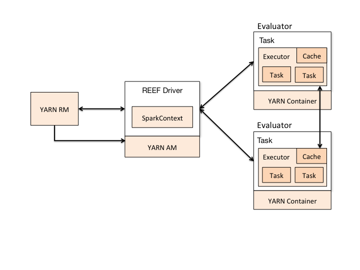

Support for running on [REEF (Retainable Evaluator Execution Framework)](http://www.reef-project.org)
was added to Spark in version 1.0.1, and improved in subsequent releases.

# How it Works

When using REEF, the REEF Driver runs the Spark Driver inside.

  

Now when the Spark Driver creates a job and starts issuing tasks for scheduling, it sends tasks to Spark Executor
running as REEF Task.

# Preparations

Running Spark on REEF requires REEF, Spark on REEF, YARN(2.2.0 or above), and a binary distribution of Spark which is built with YARN support.
Binary distributions can be downloaded from the Spark project website.
To build Spark yourself, refer to the [building with Maven guide](building-with-maven.html).

# Installing REEF

Instruction for installing REEF can be found [here](https://github.com/Microsoft-CISL/REEF/wiki/How-to-download-and-compile-REEF).

You also need [Spark on REEF](https://github.com/cmssnu/spark_on_reef) module to connect Spark and REEF.

If you already have REEF, you can skip this REEF installation step.

# Spark Configuration

Most of the configs are the same for Spark on REEF as for other deployment modes. See the [configuration page](configuration.html) for more information on those.

# REEF Configuration

You can assign memory of REEF Driver and Evaluators and number of Evaluators. See example below for more information.

# Launching Spark on REEF

In current version of Spark on REEF, the REEF Driver runs on an application master process which is managed by YARN on the cluster, and the client can go away after initiating the application.

Like in Spark YARN mode, in which the ResourceManager's address is picked up from the Hadoop configuration, Spark on REEF's master parameter is simply "reef" by default.

To launch a Spark application in REEF mode, run command below in spark_on_reef directory:

    ./bin/run.sh -class path.to.your.Class [Spark on REEF options] <app jar> [app options]

For example:

    $ ./bin/run.sh -class org.apache.spark.examples.SparkPi \
        -num_evaluators 1 \
        -evaluator_memory 512 \
        -driver_memory 256 \
        -executor_cores 1 \
        -jars path.to.spark-examples*.jar \
        -args 10

(Current version assigns Evaluator's memory to Spark Executors.)

By default, Spark on REEF will use a Spark JAR installed locally, but the Spark JAR can also be in a world-readable location on HDFS. REEF will cache Spark JAR from desired location to each nodes.

To use YARN as RM:

    set -mode yarn

Ensure that `HADOOP_CONF_DIR` or `YARN_CONF_DIR` points to the directory which contains the (client side) configuration files for the Hadoop cluster. These configs are used to write to the dfs and connect to the YARN ResourceManager.

For any help, run:

    ./bin/run.sh -help true

## Adding Other JARs

For application that requires mulitple jars as its dependency, you can add more jars as comma-separated list of path to jar file.

    $ ./bin/run.sh --class my.main.Class \
        -jars path.to.my-other-jar.jar,path.to.my-other-other-jar.jar, \
        path.to.my-main-jar.jar \
        -args app_arg1,app_arg2

# Debugging your Application

In -mode local, you can find logs and outputs in REEF_LOCAL_RUNTIME directory for REEF driver and each Evaluators.

In -mode YARN, if log aggregation is turned on (with the `yarn.log-aggregation-enable` config), container logs are copied to HDFS and deleted on the local machine. These logs can be viewed from anywhere on the cluster with the "yarn logs" command.

    yarn logs -applicationId <app ID>
    
will print out the contents of all log files from all containers from the given application.

When log aggregation isn't turned on, logs are retained locally on each machine under `YARN_APP_LOGS_DIR`, which is usually configured to `/tmp/logs` or `$HADOOP_HOME/logs/userlogs` depending on the Hadoop version and installation. Viewing logs for a container requires going to the host that contains them and looking in this directory.  Subdirectories organize log files by application ID and container ID.

To review per-container launch environment, increase `yarn.nodemanager.delete.debug-delay-sec` to a
large value (e.g. 36000), and then access the application cache through `yarn.nodemanager.local-dirs`
on the nodes on which containers are launched. This directory contains the launch script, JARs, and
all environment variables used for launching each container. This process is useful for debugging
classpath problems in particular. (Note that enabling this requires admin privileges on cluster
settings and a restart of all node managers. Thus, this is not applicable to hosted clusters).

# Important Notes

- Current version does not support python files.
- Future release will allow users to pick Yarn or Mesos as Resource Manager.
- The local directories used by Spark executors will be the local directories configured for YARN (Hadoop YARN config `yarn.nodemanager.local-dirs`).
- The `-jars` option allows the `SparkContext.addJar` function to work if you are using it with local files and running in `-mode yarn`.
